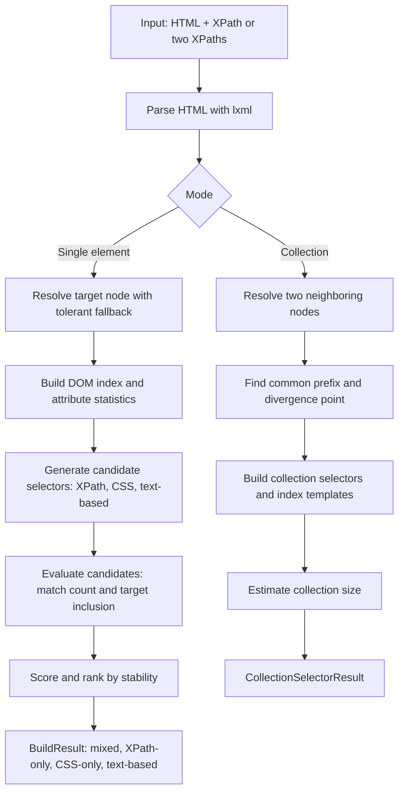

# Smart Selector

Smart Selector is a Python library that builds robust, human-readable XPath and CSS selectors from raw HTML and an absolute XPath of a target element.

[Russian documentation (RU)](docs/README_RU.md)

## Why Smart Selector
- Robust ranking model: candidates are scored by uniqueness, anchor quality, readability, and fragility penalties.
- Multiple output views: mixed ranking plus XPath-only, CSS-only, and text-based variants.
- Practical fallbacks: tolerant target resolution and structural fallbacks for imperfect snapshots.
- Catalog-ready mode: build collection selectors and index templates from two neighboring item XPaths.
- Debug support: optional debug report with strategy counts and evaluation errors.

## Quick Start

### 1. Install dependencies
Using pip:
```bash
pip install lxml cssselect pytest
```

Using Pipenv:
```bash
pipenv install --dev
```

### 2. Single element selector generation
```python
from pathlib import Path
from lxml import html as lxml_html
from smart_selector import build_selectors

html = Path("html_examples/amazon.html").read_text(encoding="utf-8", errors="ignore")
doc = lxml_html.fromstring(html)
target = doc.xpath("//*[@id='nav-search-submit-button']")[0]
abs_xpath = doc.getroottree().getpath(target)

result = build_selectors(html, abs_xpath)

print("Best XPath:", result.best_xpath)
print("Best CSS:", result.best_css)

print("Mixed variants:", result.variants[:5])
print("XPath-only:", result.xpath_variants[:3])
print("CSS-only:", result.css_variants[:3])
print("Text-based:", result.variants_with_text[:3])
```

### 3. Collection selector generation (catalog pages)
```python
from smart_selector import build_collection_selector

collection = build_collection_selector(
    html,
    first_absolute_xpath="/html/body/.../article[1]",
    second_absolute_xpath="/html/body/.../article[2]",
)

print(collection.collection_xpath)
print(collection.collection_css)
print(collection.item_xpath_template)  # ...[{i}]...
print(collection.item_css_template)    # ...:nth-of-type({i})...
print(collection.estimated_count)
```

## Public API

### Single element mode
- `build_selectors(html, absolute_xpath, config=None) -> BuildResult`
- `build_best_selector(html, absolute_xpath, config=None) -> SelectorVariant | None`
- `build_xpath_variants(html, absolute_xpath, config=None) -> list[SelectorVariant]`
- `build_css_variants(html, absolute_xpath, config=None) -> list[SelectorVariant]`
- `build_text_variants(html, absolute_xpath, config=None) -> list[SelectorVariant]`
- `analyze_selector(html, absolute_xpath, config=None) -> dict`

### Collection mode
- `build_collection_selector(html, first_absolute_xpath, second_absolute_xpath, config=None) -> CollectionSelectorResult`
- `analyze_collection_selector(...) -> dict`

## Data Flow



## How It Works

### Single element pipeline
1. Parse HTML with `lxml`.
2. Resolve target node from absolute XPath (with tolerant fallback).
3. Build DOM index (class and attribute frequencies).
4. Generate XPath/CSS candidates:
- stable attributes,
- attribute combinations,
- ancestor anchors,
- class chains,
- text-based XPath candidates,
- positional and structural fallbacks.
5. Evaluate each candidate:
- match count,
- target inclusion.
6. Score and rank candidates:
- uniqueness and anchor bonuses,
- readability bonus,
- fragility penalties (absolute/long/deep/position/text-heavy),
- optional mutation-resilience score.
7. Return result slices:
- `variants`, `xpath_variants`, `css_variants`, `variants_with_text`.

### Collection mode pipeline
1. Resolve two neighboring target nodes.
2. Build resolved DOM paths.
3. Find common prefix and divergence point.
4. Build:
- collection selector,
- index-based item templates (`{i}`).
5. Try to shorten with stable ancestor anchors (`id`, `data-*`, class).
6. Estimate item count from resulting collection XPath.

## Examples

### 1. Use browser-copied absolute XPath
```python
from pathlib import Path
from smart_selector import build_selectors

html = Path("html_examples/amazon.html").read_text(encoding="utf-8", errors="ignore")
abs_xpath = "/html/body/div[1]/header/div/div[1]/div[2]/div/form/div[3]/div/button"

result = build_selectors(html, abs_xpath)
print(result.best_xpath)
print(result.best_css)
```

### 2. Pass a manually written XPath (non-absolute)
```python
from pathlib import Path
from smart_selector import build_selectors

html = Path("html_examples/habr.html").read_text(encoding="utf-8", errors="ignore")
manual_xpath = "//h1[normalize-space()='Моя лента']"

result = build_selectors(html, manual_xpath)
print(result.target_found)
print(result.best_xpath)
```

### 3. Get per-type top candidates only (XPath/CSS)
```python
from pathlib import Path
from lxml import html as lxml_html
from smart_selector import SelectorConfig, build_css_variants, build_xpath_variants

html = Path("html_examples/reddit.html").read_text(encoding="utf-8", errors="ignore")
doc = lxml_html.fromstring(html)
abs_xpath = doc.getroottree().getpath(doc.xpath("//*[@id='main-content']")[0])

config = SelectorConfig(max_variants=8)
top_xpath = build_xpath_variants(html, abs_xpath, config=config)[:3]
top_css = build_css_variants(html, abs_xpath, config=config)[:3]

print(top_xpath)
print(top_css)
```

### 4. Request text-based selectors for stable labels
```python
from pathlib import Path
from smart_selector import build_text_variants

html = Path("html_examples/ozon.html").read_text(encoding="utf-8", errors="ignore")
xpath = "//a[normalize-space()='Электроника']"

text_variants = build_text_variants(html, xpath)
for variant in text_variants[:5]:
    print(variant.selector, variant.score)
```

### 5. Build a collection selector and iterate items by index
```python
from pathlib import Path
from smart_selector import build_collection_selector

html = Path("html_examples/worldcoinindex.html").read_text(encoding="utf-8", errors="ignore")

collection = build_collection_selector(
    html,
    first_absolute_xpath="(//table[@id='myTable']//tbody/tr)[1]",
    second_absolute_xpath="(//table[@id='myTable']//tbody/tr)[2]",
)

print(collection.collection_xpath)
print(collection.item_xpath_template)

for i in range(1, 6):
    print(collection.item_xpath_template.format(i=i))
```

## Result Models

### BuildResult
- `target_found`
- `absolute_xpath`
- `best_xpath`
- `best_css`
- `variants` (mixed ranking)
- `xpath_variants` (XPath-only)
- `css_variants` (CSS-only)
- `variants_with_text` (text-based XPath)
- `debug_report`

### SelectorVariant
- `selector`, `selector_type`, `strategy`
- `score`, `stability_level`
- `match_count`, `target_matched`, `is_unique`
- `is_text_based`
- `breakdown`

### CollectionSelectorResult
- `ok`, `reason`
- input and resolved XPaths
- `collection_xpath`, `collection_css`
- `item_xpath_template`, `item_css_template`
- `sample_item_xpath`, `sample_item_css`
- `estimated_count`

## Project Structure

```text
smart_selector/
  __init__.py
  api.py
  config.py
  models.py
  dom/
    parser.py
    resolver.py
    index.py
  generation/
    base.py
    xpath_generators.py
    css_generators.py
  validation/
    evaluator.py
  scoring/
    rules.py
    stability.py
  engine/
    orchestrator.py
    collection_builder.py

tests/
  integration/
  unit/
```

## Best Practices
- Prefer stable semantic anchors (`id`, `data-*`, `aria-*`) over absolute paths.
- Use `variants` for general ranking and per-type views for strict engine requirements.
- Use text variants for stable UI labels and menu items.
- For catalog/list pages, prefer `build_collection_selector(...)` over manual absolute path slicing.

## Limitations
- Static HTML snapshots may differ from browser-rendered DOM after JS hydration.
- Heavily obfuscated dynamic classes can reduce CSS selector quality.
- Text-based selectors can be sensitive to localization and A/B experiments.

## LICENSE
[MIT License](./LICENSE.md)

## Author
[JQ/Quoterbox](https://github.com/quoterbox)
