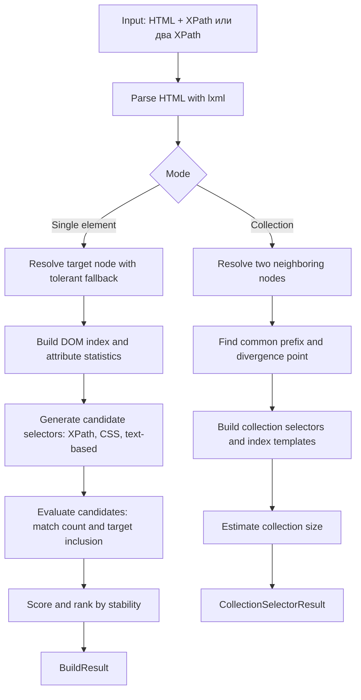

# Smart Selector: Documentation (RU)

Main documentation in English is in `README.md`.

## Обзор
Smart Selector — библиотека на Python для построения устойчивых XPath/CSS селекторов по:
- HTML-странице,
- XPath целевого элемента (абсолютному или вручную написанному).

Поддерживает два режима:
1. **Single element mode**: подбор селекторов для одного поля.
2. **Collection mode**: построение селектора списка/каталога по двум соседним XPath.

## Быстрый старт

### Установка
```bash
pip install lxml cssselect pytest
```
или
```bash
pipenv install --dev
```

### Одиночный элемент
```python
from pathlib import Path
from smart_selector import build_selectors

html = Path("html_examples/amazon.html").read_text(encoding="utf-8", errors="ignore")
abs_xpath = "/html/body/..."

result = build_selectors(html, abs_xpath)

print(result.best_xpath)
print(result.best_css)
print(result.variants[:5])
```

### Каталог/список по двум соседям
```python
from smart_selector import build_collection_selector

collection = build_collection_selector(
    html,
    first_absolute_xpath="/html/body/.../article[1]",
    second_absolute_xpath="/html/body/.../article[2]",
)

print(collection.collection_xpath)
print(collection.collection_css)
print(collection.item_xpath_template)  # ...[{i}]...
print(collection.item_css_template)    # ...:nth-of-type({i})...
print(collection.estimated_count)
```

## API

### Для одиночного элемента
- `build_selectors(html, absolute_xpath, config=None) -> BuildResult`
- `build_best_selector(html, absolute_xpath, config=None) -> SelectorVariant | None`
- `build_xpath_variants(html, absolute_xpath, config=None) -> list[SelectorVariant]`
- `build_css_variants(html, absolute_xpath, config=None) -> list[SelectorVariant]`
- `build_text_variants(html, absolute_xpath, config=None) -> list[SelectorVariant]`
- `analyze_selector(html, absolute_xpath, config=None) -> dict`

### Для коллекций
- `build_collection_selector(html, first_absolute_xpath, second_absolute_xpath, config=None) -> CollectionSelectorResult`
- `analyze_collection_selector(...) -> dict`

## Поток данных



## Примеры

### 1. Абсолютный XPath из браузера
```python
from pathlib import Path
from smart_selector import build_selectors

html = Path("html_examples/amazon.html").read_text(encoding="utf-8", errors="ignore")
abs_xpath = "/html/body/div[1]/header/div/div[1]/div[2]/div/form/div[3]/div/button"

result = build_selectors(html, abs_xpath)
print(result.best_xpath)
print(result.best_css)
```

### 2. Вручную написанный XPath (не абсолютный)
```python
from pathlib import Path
from smart_selector import build_selectors

html = Path("html_examples/habr.html").read_text(encoding="utf-8", errors="ignore")
manual_xpath = "//h1[normalize-space()='Моя лента']"

result = build_selectors(html, manual_xpath)
print(result.target_found)
print(result.best_xpath)
```

### 3. Только лучшие XPath/CSS варианты
```python
from pathlib import Path
from lxml import html as lxml_html
from smart_selector import SelectorConfig, build_xpath_variants, build_css_variants

html = Path("html_examples/reddit.html").read_text(encoding="utf-8", errors="ignore")
doc = lxml_html.fromstring(html)
abs_xpath = doc.getroottree().getpath(doc.xpath("//*[@id='main-content']")[0])

cfg = SelectorConfig(max_variants=8)
print(build_xpath_variants(html, abs_xpath, config=cfg)[:3])
print(build_css_variants(html, abs_xpath, config=cfg)[:3])
```

### 4. Текстовые селекторы для стабильных лейблов
```python
from pathlib import Path
from smart_selector import build_text_variants

html = Path("html_examples/ozon.html").read_text(encoding="utf-8", errors="ignore")
variants = build_text_variants(html, "//a[normalize-space()='Электроника']")

for variant in variants[:5]:
    print(variant.selector, variant.score)
```

### 5. Групповой селектор каталога + шаблон итерации
```python
from pathlib import Path
from smart_selector import build_collection_selector

html = Path("html_examples/worldcoinindex.html").read_text(encoding="utf-8", errors="ignore")

collection = build_collection_selector(
    html,
    first_absolute_xpath="(//table[@id='myTable']//tbody/tr)[1]",
    second_absolute_xpath="(//table[@id='myTable']//tbody/tr)[2]",
)

print(collection.collection_xpath)
print(collection.item_xpath_template)
for i in range(1, 6):
    print(collection.item_xpath_template.format(i=i))
```

## Что возвращается

### BuildResult
- `target_found`
- `best_xpath`, `best_css`
- `variants` (общий рейтинг)
- `xpath_variants` (только XPath)
- `css_variants` (только CSS)
- `variants_with_text` (текстовые XPath)
- `debug_report`

### CollectionSelectorResult
- `ok`, `reason`
- `collection_xpath`, `collection_css`
- `item_xpath_template`, `item_css_template`
- `sample_item_xpath`, `sample_item_css`
- `estimated_count`

## Логика работы

### Одиночный элемент
1. Парсинг HTML (`lxml`).
2. Резолв target по XPath (с tolerant fallback).
3. Генерация кандидатов XPath/CSS разными стратегиями.
4. Валидация каждого кандидата (match count + попадание в target).
5. Скоринг и сортировка.
6. Формирование отдельных срезов выдачи.

### Коллекция
1. Резолв двух соседних элементов.
2. Нахождение общей части путей и точки расхождения.
3. Построение общего селектора списка.
4. Построение шаблона элемента с индексом `{i}`.
5. Попытка сократить путь через якоря предков (`id`, `data-*`, class).

## Структура проекта

```text
smart_selector/
  api.py
  config.py
  models.py
  dom/
  generation/
  validation/
  scoring/
  engine/

tests/
  integration/
  unit/
```

## Практические советы
- Предпочитай `id`, `data-*`, `aria-*` вместо длинных абсолютных путей.
- Для каталога используй `build_collection_selector(...)`.
- Текстовые селекторы удобны для UI-лейблов, но чувствительны к изменениям текста.

## Ограничения
- Локальный HTML-снимок может отличаться от DOM в браузере после JS-гидрации.
- Сильно динамические обфусцированные классы ухудшают качество CSS.
